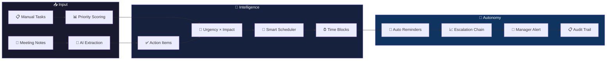

<div align="center">


# FlowMind AI

### Agentic Productivity OS — From Meeting Notes to Accountable Tasks

[](https://github.com/joshiyaa-dev/flowmind-ai)


</div>

---

## The Problem

Productivity tools force you to choose: Kanban OR calendar? Tasks OR focus? Manual OR automated? Meeting notes sit forgotten while action items slip through the cracks. Teams need **autonomous accountability** — not another todo list.

**FlowMind AI** combines meeting intelligence, AI prioritization, autonomous reminders, and full audit trail into one system that **doesn't wait for you to remember**.

---

## How It Works



---

## Feature Deep Dive

### 📝 Meeting Intelligence

| Feature | Description | Why It Matters |
|---------|-------------|----------------|
| **Note Ingestion** | Paste or type meeting notes | Centralize all meeting output |
| **AI Action Extraction** | Automatically identifies tasks, owners, deadlines | No more "who was supposed to do what?" |
| **Owner Assignment** | Assign tasks to team members | Clear accountability |
| **Deadline Detection** | Extracts dates from natural language | "by Friday" becomes a real deadline |
| **Meeting Summaries** | AI-generated recap with key decisions | Share with absent team members |

### 🎯 Smart Prioritization

| Feature | Description | Why It Matters |
|---------|-------------|----------------|
| **AI Priority Scoring** | Urgency × Impact × Deadline weighting | Focus on what matters most |
| **Kanban Board** | Drag-and-drop columns (Todo/In Progress/Done) | Visual workflow management |
| **Time Blocking** | Auto-fills calendar with task slots | Protects focus time |
| **Focus Mode** | Full-screen single-task with timer | Eliminates context switching |
| **Pomodoro+** | Adaptive intervals based on task complexity | Matches your energy to the task |

### 🔄 Autonomous Accountability

| Feature | Description | Why It Matters |
|---------|-------------|----------------|
| **Auto Reminders** | System sends reminders at optimal times | Tasks don't get forgotten |
| **Escalation Chain** | Uncompleted tasks escalate to manager | Accountability without micromanaging |
| **EOD Review** | Daily summary with tomorrow preview | End each day with clarity |
| **Weekly Analytics** | Time spent, completion rates, patterns | Data-driven productivity insights |
| **Audit Trail** | Who did what, when, with timestamps | Full accountability for compliance |

---

## Tech Stack

```
flowmind-ai/
├── src/                          # Frontend (React + TypeScript)
│   ├── components/
│   │   ├── TaskBoard.tsx        # Kanban drag-and-drop
│   │   ├── FocusTimer.tsx       # Pomodoro + binaural beats
│   │   ├── MeetingNotes.tsx     # Note editor + AI extraction
│   │   ├── Analytics.tsx        # Charts + insights
│   │   ├── Calendar.tsx         # Time block visualization
│   │   └── AuditLog.tsx         # Activity trail
│   ├── hooks/
│   │   ├── useFlow.ts           # Flow state management
│   │   ├── useAI.ts             # AI priority scoring
│   │   ├── useTimer.ts          # Focus timer logic
│   │   └── useReminders.ts      # Auto-reminder scheduling
│   ├── lib/
│   │   ├── types.ts             # Task, Meeting, Audit types
│   │   ├── ai.ts                # Priority scoring algorithm
│   │   ├── scheduler.ts         # Time block generator
│   │   └── store.ts             # State management
│   └── App.tsx
├── server/                       # Backend (FastAPI + Python)
│   ├── main.py                  # API entry point
│   ├── routes/
│   │   ├── tasks.py             # Task CRUD + priority
│   │   ├── meetings.py          # Meeting note processing
│   │   ├── analytics.py         # Usage analytics
│   │   └── audit.py             # Audit trail queries
│   ├── services/
│   │   ├── ai.py                # AI extraction + scoring
│   │   ├── reminders.py         # Auto-reminder engine
│   │   └── escalation.py        # Escalation chain logic
│   └── models/
│       ├── task.py              # Task schema
│       └── meeting.py           # Meeting schema
├── docs/
│   └── hero.svg                 # Animated SVG hero
└── package.json
```

---

## Quick Start

```bash
# Frontend
git clone https://github.com/joshiyaa-dev/flowmind-ai.git
cd flowmind-ai
npm install
npm run dev        # → http://localhost:5173

# Backend
cd server
pip install -r requirements.txt
uvicorn main:app --reload  # → http://localhost:8000

# Test
npm test
```

---

## The Priority Algorithm

```
Input:  { urgency: 1-5, impact: 1-5, deadline: Date, age: days }
Output: priorityScore: 0-100

Algorithm:
1. baseScore = (urgency × 0.4) + (impact × 0.4) + (recency × 0.2)
2. deadlineMultiplier = max(1, 7 / daysUntilDeadline)
3. ageMultiplier = min(2, 1 + (age / 14))
4. finalScore = baseScore × deadlineMultiplier × ageMultiplier
5. Clamp to [0, 100]
6. Map to priority: Critical (80+), High (60-79), Medium (40-59), Low (<40)

Escalation Rules:
- After 24h no action → Send reminder to assignee
- After 48h no action → CC team lead
- After 72h no action → Escalate to manager
- After 1 week no action → Flag in weekly review
```

---

## Data Honesty

| Data | Storage | Retention | Third-Party |
|------|---------|-----------|-------------|
| Tasks | Backend DB + localStorage | Until deleted | ❌ Never shared |
| Meeting notes | Backend DB | Until deleted | ❌ Never shared |
| Audit trail | Backend DB | Permanent | ❌ Never shared |
| Analytics | Computed on-the-fly | Not stored | ❌ Never sent |
| Focus sessions | localStorage | Session only | ❌ Never sent |

**No third-party AI. No telemetry. No PII leakage.**

---

## License

MIT © [joshiyaa-dev](https://github.com/joshiyaa-dev)

<div align="center">


**Flow state, engineered. Stop managing. Start flowing.**

</div>
